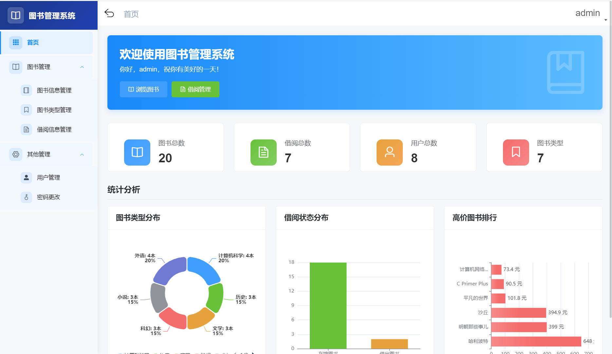
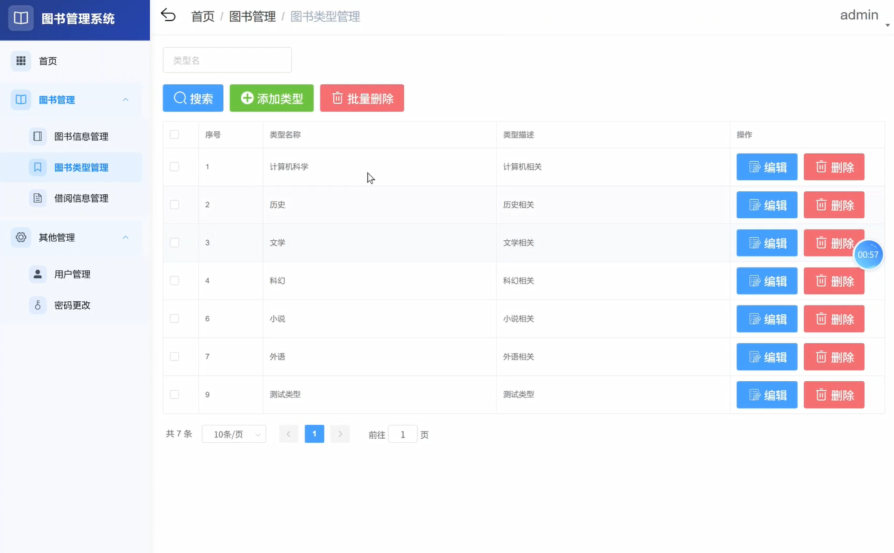
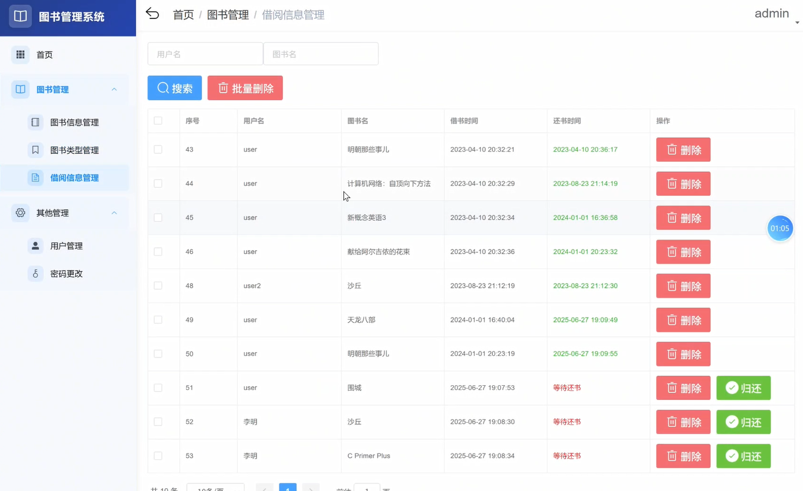
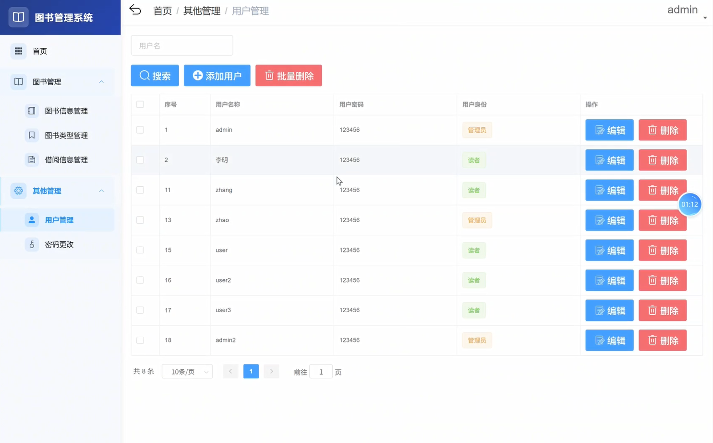
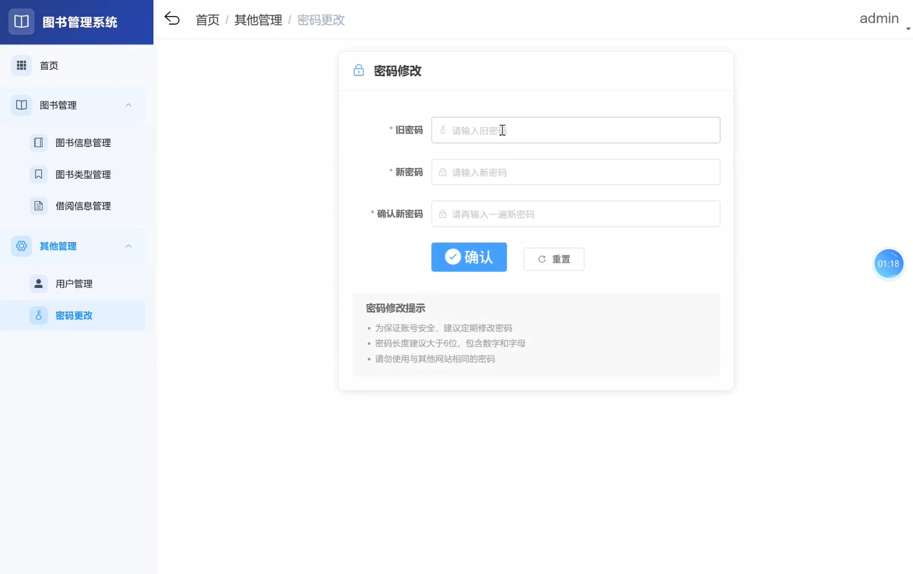

<h1 align="center">Book Management System</h1>

<p align="center">
  A web-based <strong>book / library management system</strong> built with <strong>Spring Boot + Vue (Element UI)</strong>.
</p>

<p align="center">
  
  
  
  
  
  
  
  
  
  
</p>

<p align="center">
  <a href="#installation">Installation</a> ·
  <a href="#what-is-it">What is it?</a> ·
  <a href="#features">Features</a> ·
  <a href="#tech-stack">Tech Stack</a> ·
  <a href="#project-structure">Project Structure</a> ·
  <a href="#screenshots">Screenshots</a> ·
  <a href="#database">Database</a> ·
  <a href="#default-accounts">Default Accounts</a> ·
  <a href="#notes">Notes</a> ·
  <a href="#license">License</a>
</p>

<p align="center">
  <a href="README.md"><strong>English</strong></a> · <a href="README.zh-CN.md">简体中文</a>
</p>

---

<a id="installation"></a>
## 🚀 Installation

### Prerequisites

- **JDK 8**
- **MySQL 8.0** (the dump runs on MySQL 8.0+)
- **Redis** (any version, e.g. Redis 3.2; used for caching)
- **Node.js 14** (the frontend toolchain targets Node 14)
- **Maven 3.5** (use apache-maven-3.5.0`)
- **IntelliJ IDEA** (recommended for the backend)

### Steps

**1. Get the code**

```bash
git clone https://github.com/Je-taimais/book-management-system.git
cd book-management-system
```

**2. Prepare the database**

```sql
CREATE DATABASE `db_book` CHARACTER SET utf8mb4 COLLATE utf8mb4_general_ci;
USE `db_book`;
SOURCE database/db_book.sql;
-- optional: add a `stock` column (lendable inventory) to book_info
SOURCE database/upgrade_stock.sql;
```

**3. Start Redis**

```
redis-server
```

> Default connection: `localhost:6379`, no password — matches `application.yml`.

**4. Run the backend (`book-backend`)**

- Open `book-backend` in IntelliJ IDEA.
- Set **Project SDK = Java 8** and **Maven home = `D:\apache-maven-3.5.0`**.
- Run `com.shanzhu.book.BackendApplication`.
- Or from a terminal (with Maven 3.5 on `PATH`):

```bash
cd book-backend
mvn spring-boot:run
```

> The backend listens on `http://localhost:9111/BookManager`.
> Database credentials are in `src/main/resources/application.yml` (default `root` / `root`) — change them to match your MySQL.

**5. Run the frontend (`book-frontend`)**

```bash
cd book-frontend
npm install      # use Node.js 14
npm run dev      # dev server on http://localhost:9112
```

Open **http://localhost:9112**. The frontend proxies API calls to the backend under `/BookManager`.

For a production build:

```bash
npm run build:prod   # outputs dist/ (served under /BookManager)
```

---

<a id="what-is-it"></a>
## 📚 What is it?

Book Management System is a web-based (B/S) library management platform built with a **Spring Boot** backend and a **Vue + Element UI** frontend. It serves two roles:

- **Administrators** maintain the book catalog, categories, borrow records, users, overdue items, and fine payments from a back-office console, and monitor the system through a dashboard with charts.
- **Readers** browse and keyword-search the catalog, borrow / return books, view their own borrow history, see overdue items, pay fines, and change their password.

The project follows a clean front-end / back-end separated architecture: the backend exposes a REST API (MyBatis + MySQL + Redis), while the frontend is a single-page application built with Vue CLI.

---

<a id="problem-it-solves"></a>
## 🎯 Problem It Solves

Traditional library circulation relies on manual, paper-based or ad-hoc tracking, which is error-prone and makes it hard to know what is borrowed, overdue, or out of stock. This project unifies the whole workflow into one web application:

- **For librarians:** a visual back office for cataloging books, managing categories and users, handling borrow/return, and collecting fines — no more spreadsheets.
- **For readers:** self-service browsing, searching, borrowing, returning, and fine payment through a friendly UI.
- **For managers:** a dashboard with real-time statistics (total books, total borrows, total users, book-type distribution, borrow-status distribution, high-price ranking) to support decisions.
- **For learners:** a readable Spring Boot + Vue full-stack example suitable for coursework / study.

---

<a id="features"></a>
## ✨ Features

### Administrator

- **Dashboard** — statistics cards & ECharts visualizations (total books / borrows / users / categories; book-type distribution, borrow-status distribution, high-price ranking)
- **Book management** — add / edit / delete books, upload cover images
- **Book type management** — manage categories
- **Borrow management** — view and manage borrow / return records
- **User management** — view and manage reader accounts
- **Overdue management** — track overdue borrows
- **Payment / fines** — manage and record fine payments
- **Password change**

### Reader

- Register / login
- Browse & keyword-search the catalog
- Borrow / return books
- View personal borrow history
- View overdue items
- Pay fines
- Change password

---

<a id="tech-stack"></a>
## 🧱 Tech Stack

| Layer | Technology |
| --- | --- |
| Backend language | Java 8 |
| Backend framework | Spring Boot 2.5.6 |
| ORM | MyBatis 2.0 |
| Database | MySQL 8.0 |
| Cache | Redis |
| Frontend | Vue 2.6.10 + Vue CLI 4.4 |
| UI | Element UI 2.13.2 |
| Charts | ECharts 5.6 |
| State / Routing | Vuex 3.1 / Vue Router 3.0 |
| HTTP client | Axios |
| Build & IDE | Maven 3.5, IntelliJ IDEA |
| Architecture | B/S, front-end / back-end separated |

---

<a id="project-structure"></a>
## 📂 Project Structure

```
book-management-system/
├── book-backend/                # Spring Boot backend (port 9111, context /BookManager)
│   └── src/main/java/com/shanzhu/book/
│       ├── config/              # Spring config (MyBatis, Redis, interceptors…)
│       ├── exception/           # global exception handling
│       ├── interceptor/         # login / permission interceptors
│       ├── mapper/              # MyBatis mapper interfaces
│       ├── model/               # entities & DTOs
│       ├── service/ & impl/     # business logic
│       ├── utils/               # utilities
│       └── web/                 # controllers (REST API)
│       └── src/main/resources/
│           ├── application.yml  # server port, datasource, redis
│           ├── mapper/           # MyBatis XML
│           └── static/files/    # uploaded book cover images
├── book-frontend/               # Vue + Element UI frontend (dev port 9112)
│   └── src/
│       ├── api/                 # axios API modules
│       ├── views/               # pages (dashboard, bookinfo, booktype, borrow,
│       │                        #        user, overdue, payment, login, register, password…)
│       ├── router/  store/      # routing & Vuex
│       └── components/  layout/ # shared components & layout
├── database/
│   ├── db_book.sql              # schema + sample data
│   └── upgrade_stock.sql        # optional: add `stock` column
├── screenshots/                 # README screenshots
├── docs/
│   └── 图书馆系统.docx           # project document (Chinese)
├── README.md                    # this file (English)
├── README.zh-CN.md              # 简体中文
├── LICENSE
└── .gitignore
```

---

<a id="screenshots"></a>
## 🖼️ Screenshots

### Overview


### Login


### Dashboard / Home


### Book Type Management


### Borrow Management


### User Management


### Password


---

<a id="database"></a>
## 🗄️ Database

The database `db_book` contains 5 tables:

| Table | Description |
| --- | --- |
| `user` | Accounts — `userType = 1` administrator, `= 0` reader |
| `book_info` | Books (name, author, price, type, description, borrow status, cover image) |
| `book_type` | Book categories |
| `borrow` | Borrow / return records |
| `payment` | Fine / payment records |


---

<a id="default-accounts"></a>
## 🔑 Default Accounts

> Passwords are stored in plaintext (learning / coursework only — change before any real use).

| Role | Username | Password | Note |
| --- | --- | --- | --- |
| Admin | `admin` | `123456` | `userType = 1` |
| Admin | `admin2` | `123456` | `userType = 1` |
| Reader | `李明` | `123456` | `userType = 0` |

---

<a id="notes"></a>
## ⚠️ Notes

- **Ports & context:** backend runs at `http://localhost:9111/BookManager`; frontend dev server at `http://localhost:9112` and proxies API calls to the backend under `/BookManager`.
- **Database credentials** are hardcoded `root / root` in `application.yml` — change them for any real deployment.
- **Redis must be running** (default `localhost:6379`, no password); otherwise the cache layer will fail on startup / requests.
- **Book covers** under `book-backend/src/main/resources/static/files` are committed so the UI is complete out of the box.
- **Node.js 14** is required: the toolchain (notably `node-sass`) targets Node 14; a newer Node may break `npm install`.

---

<a id="license"></a>
## 📄 License

This project is released under the [MIT License](LICENSE). You are free to use, copy, modify, and redistribute it, provided the copyright notice and permission notice are included.

---

<div align="center">Made with ❤️ by <a href="https://github.com/Je-taimais">Je-taimais</a> · <a href="README.zh-CN.md">简体中文</a></div>
